# Credit_Risk_Analysis

## Overview

The purpose of this project is to analysis all the factors in our loan dataset to help predict whether someone is a low or high credit risk.

The following analysis was performed:

- Oversampling of the data using RandomOverSampler and SMOTE algorithms.
- Undersampling the data using the ClusterCentroids algorithm.
- Combined the approach of oversampling and undersampling using the SMOTEENN algorithm.
- Two models were compared to reduce bias, BalancedRandomForestClassifier and EasyEnsembleClassifier.

We used the following resources:
Dataset: https://raw.githubusercontent.com/imrtech/Credit_Risk_Analysis/main/LoanStats_2019Q1.csv

Applications:
- Python
- Jupyter Notebook

## Results

### Random Oversampling results:
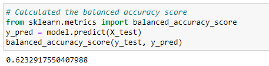

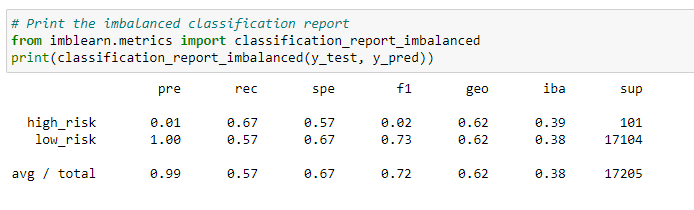

- The balanced accuracy score is 62%.
- The high_risk precision is about 1% with 67% sensitivity which makes a F1 score of 2%.
- The precision is almost 100% with a sensitivity of 57%.

### SMOTE Oversampling results:
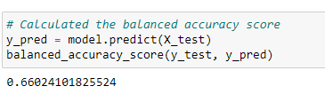

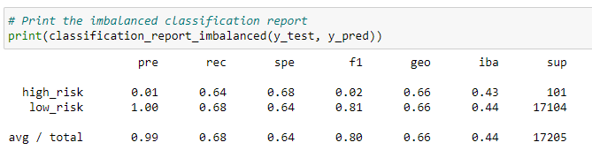

- The balanced accuracy score is 66%.
- The high_risk precision is about 1% with 64% sensitivity which makes a F1 score of 2%.
- The precision is almost 100% with a sensitivity of 68%.

### Undersampling results:

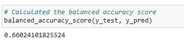
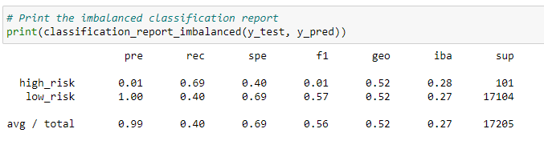

- The balanced accuracy score is 66%.
- The high_risk precision is about 1% with 69% sensitivity which makes a F1 score of 1%.
- The precision is almost 100% with a sensitivity of 40%.

### Combination Oversampling and Undersampling results:

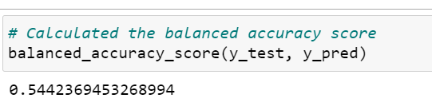
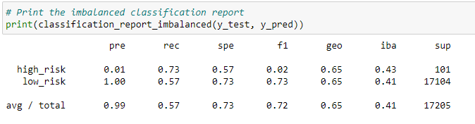

- The balanced accuracy score is 54%.
- The high_risk precision is about 1% with 73% sensitivity which makes a F1 score of 2%.
- The precision is almost 100% with a sensitivity of 57%.

### Random Forest results:

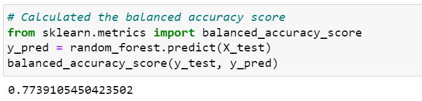
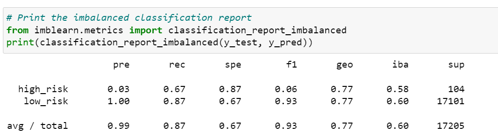

- The balanced accuracy score is 77%.
- The high_risk precision is about 3% with 67% sensitivity which makes a F1 score of 6%.
- The precision is almost 100% with a sensitivity of 87%.

### Easy Ensemble results:

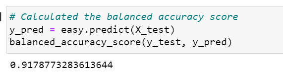
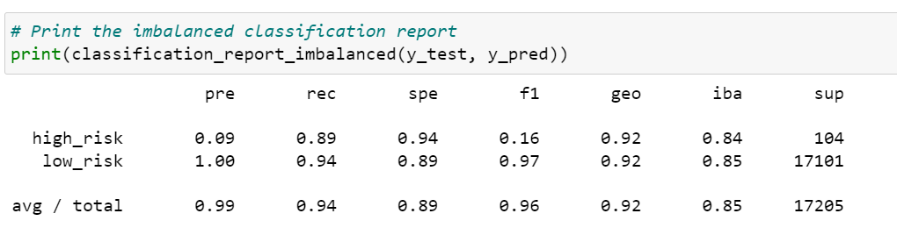

- The balanced accuracy score is 91%.
- The high_risk precision is about 9% with 89% sensitivity which makes a F1 score of 16%.
- The precision is almost 100% with a sensitivity of 94%.

### Summary

